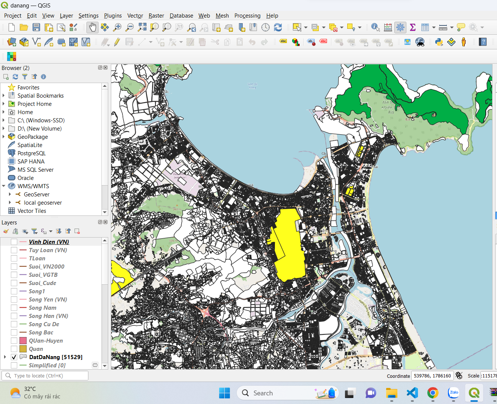
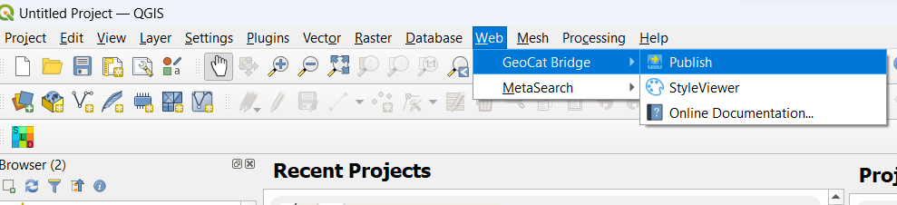
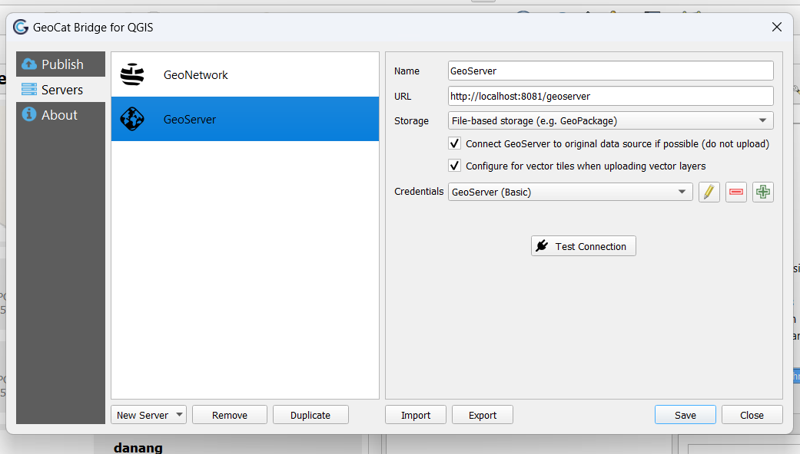
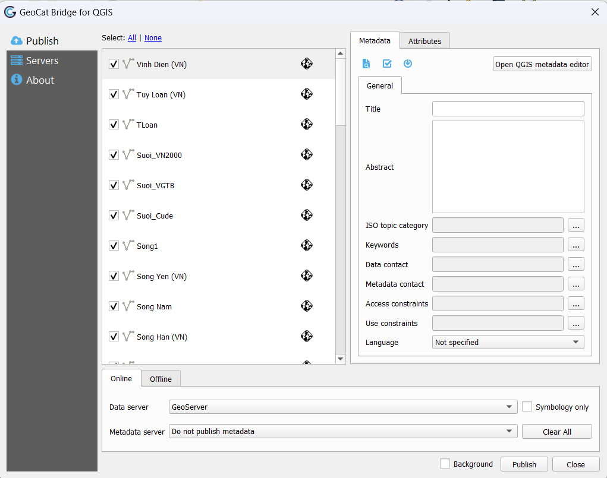
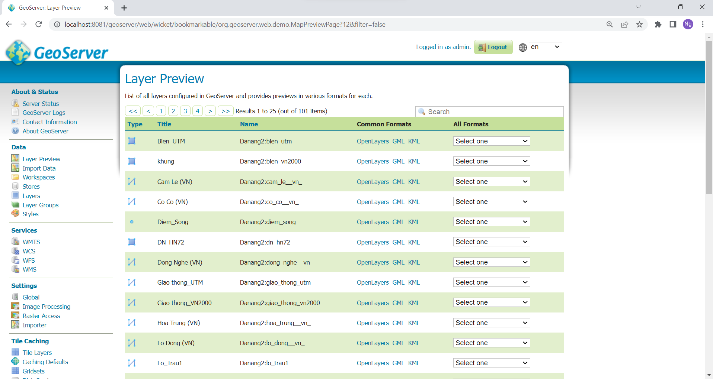

# WebGIS-DATN
required node version > v.16.7

install GeoServer 2.22.0, the account default will be (username: admin, password: geoserver)

# how to upload GIS data into geoserver (This step only for user that not using postgresql for storage):
required GIS GUI, here we use QGIS 3.30.0

Most important plugins (DB Manager, GeoCat Bridge)

Step:

› Open data with QGIS (in type geopackage, shp, xml, ...).

› The layer list of data will appear in the bottom left


› choose publish on the menu bar -> Web -> GeoCat Bridge


› Setup for the available GeoServer


› Select the layers you want to setup on GeoServer than Publish


› The layers are now ready on GeoServer


# how to run nuxt-app:
Nuxt project is created with v3 template. 

Next steps:

 › cd app

 › Install dependencies with npm install or yarn install or pnpm install
 
 › Start development server with npm run dev or yarn dev or pnpm run dev
# GIS app (app) command

a GIS project using quasar

## Install the dependencies
```bash
yarn install
# or
npm install
```

### Start the app in development mode (hot-code reloading, error reporting, etc.)
```bash
npm dev
# or
yarn dev
# or
quasar dev
```

### Start the GUI app in development mode (hot-code reloading, error reporting, etc.)

```bash
quasar dev -m electron
```


### Lint the files
```bash
yarn lint
# or
npm run lint
```


### Format the files
```bash
yarn format
# or
npm run format
```


### Build the app for production
```bash
quasar build
```

### Customize the configuration
See [Configuring quasar.config.js](https://v2.quasar.dev/quasar-cli-vite/quasar-config-js).

# How to host express server:
Need to setup the database.

First, typeScript is needed for prisma to work. install typeScript
### generate a prisma client
```bash
npx prisma generate
```
### migrate database in prisma: can be use with --create-only, -skip-generate
```bash
npx prisma migrate
npx prisma migrate --create-only
npx prisma migrate --skip-generate
```
### To access the database through a simple tabular interface (port:5555 by default)
```bash
npx prisma studio
```

### Start server(port:3000 by default)
```bash
node server.js
#or
yarn start:rest
```